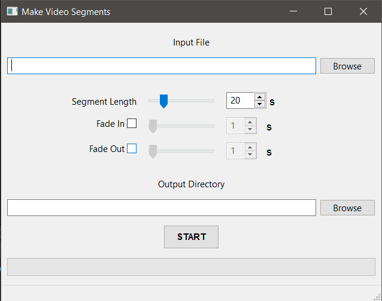

# Make Video Segments
Simple program that takes a video and splits it into segments of a specified length of time.

Can also add a configurable fade in and fade out to each segment.

Form built with WxFormBuilder.
Build with pyinstaller.
